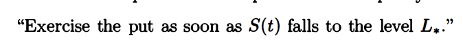
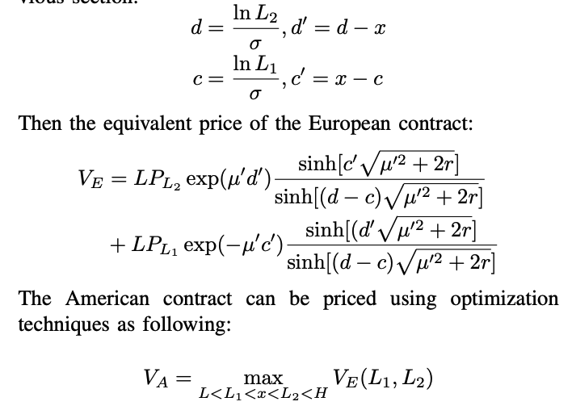

# part 5: Pricing  

本篇中，我们会给出定价的模型。

## 假设
1. 我们假定我们必须等到价格到达边界后才能退出流动性提供。这显然与实际不符，下一篇我们会解决这个问题。
2. 此外我们还假定价格服从几何布朗运动，波动率在一段时间内都不会变化。
3. 交易量也不会发生变化，且都是以U 计价。
4. 手续费也只会在到期时收取。

## Notion

$$
LP(S)=
\begin{cases}
\lambda*S(\frac{1}{\sqrt{L}}-\frac{1}{\sqrt{H}}), S<L \\
\lambda*(2\sqrt{S}-\sqrt{L}-\frac{S}{\sqrt{H}}), L<S<H \\
\lambda*(\sqrt{H}-\sqrt{L}), H<S
\end{cases} \\
\lambda=\frac{1}{2-\sqrt{L}-\frac{1}{\sqrt{H}}}
$$

我们定义公式中的$LP_t, S, L, H$都是一种百分比含义数值，即定义：

$S_0$ 为 Uniswap V3 建仓时的标的价格  
$S_H$ 为 Uniswap V3 建仓时的 Ranger Order 上界价格  
$S_L$ 为 Uniswap V3 建仓时的 Ranger Order 下界价格  
$S_t$ 为对 Uniswap V3 的 payoff 进行估值时刻的标的价格

这个公式表明在初始投入 \$1 的资产，在$t$时刻 $S_t$退出时，本金部分的价值。

则存在：  
$S = \frac{S_t}{S_0}$  
$L = \frac{S_L}{S_0}$  
$H = \frac{S_H}{S_0}$

$x = \ln S$  
$a = \ln L$  
$b = \ln H$  
$r$ 为贴现率  
$\mu$ 为 GBM 运动的漂移率

## position的欧式定价

$$
V_{LP}=LP_HE(e^{-r\tau}|S_t=H)+LP_LE(e^{-r\tau}|S_t=L) 
$$

其中$LP_H$为在价格在H 退出时的价值。带入S=H到LP的公式里可以得到$\lambda(\sqrt{H}-\sqrt{L})$。
而 $E(e^{-r\tau}|S_t=H)$可以从上一篇的结论中拿到。
带入可得
$$
\lambda(\sqrt{H}-\sqrt{L})e^{\mu(b-x)}\frac{sinh((x-a)\sqrt{2r+\mu^2})}{sinh((b-a)\sqrt{2r+\mu^2})}+\lambda(\frac{1}{\sqrt{L}}-\frac{1}{\sqrt{H}})e^{\mu(a-x)}\frac{sinh((b-x)\sqrt{2r+\mu^2})}{sinh((b-a)\sqrt{2r+\mu^2})}
$$

## 手续费V1

我们假设手续费回报率不变且只会在最后进行提取。很显然手续费应当是 $\tau C \lambda$ 三个变量的乘积。收取的时长，流动性，和手续费回报率。我们需要做的则是对其贴现。

$$V_{fee} = \mathbb E(e^{-r\tau} \tau C\lambda) = C\lambda E(\tau e^{-r \tau})$$

进而
$$
\begin{aligned}
&\mathbb E[e^{-r\tau}\tau]= \int_{\mathbb R}\tau e^{-r\tau}p(\tau)d\tau\\
 &=\int_{0}^{\infty}\tau p(\tau)e^{-r\tau}d\tau\\
 &= \mathcal L\{\tau p(\tau)\}(r)\\
 &= -\frac{d F(r)}{dr}\\
&=\frac{(b-a)(e^{-a'\mu'}\operatorname{sh}[b'\sqrt{2r+\mu'^2}]+e^{b'\mu}\operatorname{sh}[a'\sqrt{2r+\mu'^2}])}{\operatorname{th}[(b-a)\sqrt{2r+\mu'^2}]\operatorname{sh}[(b-a)\sqrt{2r+\mu'^2}](\sqrt{2r+\mu'^2}) }
 \\& \ \ \ \ -
\frac{b' e^{-a'\mu'}\operatorname{ch}[b'\sqrt{2r+\mu'^2}]+ae^{b\mu}\operatorname{ch}[a'\sqrt{2r+\mu'^2}]}{\operatorname{sh}[(b-a)\sqrt{2r+\mu'^2}](\sqrt{2r+\mu'^2})}
\end{aligned}
$$
其中 
$$
\mu' = \frac{\mu}{\sigma}-\frac{\sigma}{2}\\
a' = a-x\\
b' = b-x\\
$$

## “欧式”定价
我们只需要拼接公式即可，公式会非常长，但是大家可以自行代换，在本系列结束时也会给出对应的代码。

$$
V = V_{LP}+V_{fee}\\
= LP_H \mathbb E(e^{-r\tau}|S_t=H)+LP_L\mathbb E(e^{-r\tau}|S_t=L) + c\lambda\mathbb E[e^{-r\tau}\tau]
$$

我们已经得到了一个可用的定价公式了，不过我们需要回顾一下我们的“条款”。
1. 我们要求LP 只能在边界退出提供流动性
2. 手续费也只能在边界退出

这两个条款和现实是有区别的，流动性提供者可以再任何时间退出提供流动性和提取手续费。这会使得我们的定价是低估的。这也就是我们的本节的标题欧式的意思。自然我们需要一个美式的定价公式，让流动性提供者能够任意时间退出。
不过在此之前，我们可以简单的讨论一下手续费的问题。

## 连续手续费
的确我们不能假设LP 的手续费提取策略，那我们退而求其次，尝试计算一下上界。即手续费是连续收取的，下界是我们的退出时提取。
我们可以如下计算

$$
E(fee) = \mathbb E [\int_0^\tau C \lambda e^{-rt}dt ]\\
=C \lambda \mathbb E[\frac{1-e^{-rt}}{r}]  \\
 =  \frac{C \lambda}{r}(1-E(e^{-r\tau}))
$$

## 美式如何定价
永续美式是没有到期时间的衍生品。但其实处理起来非常容易，在金融随机分析 卷二里有讨论过永续美式期权的定价。两者的思路也非常一致。

推荐先阅读 https://cms.dm.uba.ar/academico/materias/2docuat2016/analisis_cuantitativo_en_finanzas/Steve_ShreveStochastic_Calculus_for_Finance_II.pdf 中的第八章 Perpetual American Put 

我们简单看一下shreve 是永续美式期权定价的思路。
我们要考虑的第一件事情是如果有最佳行权策略，那么该策略只和价格有关，和t 无关。这也不难推理，由于没有到期时间，不论在哪一天你的定价应当是一样的。
那么我们可以建模为

那么这个 $L^*$是多少呢？那么他既然是最优的，显然会使得期权价格最大化，我们通过求导找出$L^*$继而带入到定价公式里即可。

那么对于uniswap v3 问题就非常好解决了。同样的，我们需要构造最佳策略,在价格到达$L1,L2$时退出，这和提供流动性的LH 有如下关系：
$$L<L_1<1<L_2<H$$

对于这个退出策略，我们找到最佳的$L_1$，$L_2$使得V最大，然后带入到定价公式里即可。

即

这里需要补充一下，函数都是连续的，当然是有导数的。但是显然再带入回去，符号计算量已经过大了。但是不妨碍我们使用传统最优化的方法做数值计算。

这里我们要抢到最优化的目标不是$V_{LP}$而是 $V$,这意味着手续费模型不同，会导致$L_1,L_2$ 也不一样。

在下一篇中，我们会进行一些数值比较，如何利用定价公式，和希腊值。