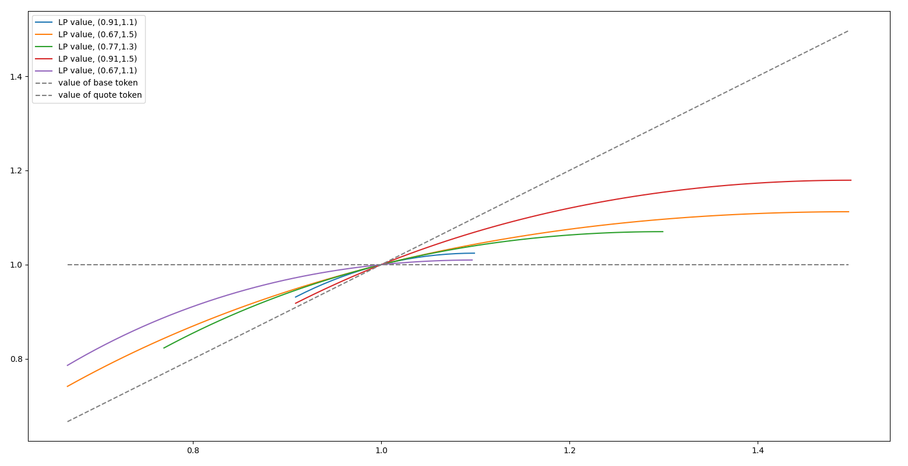
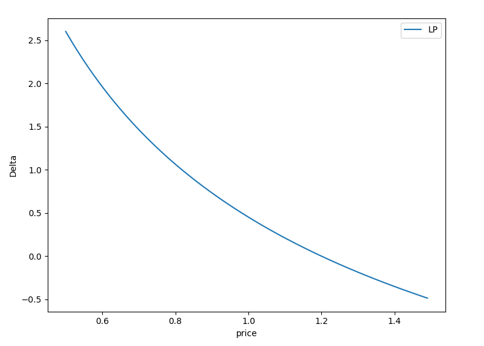
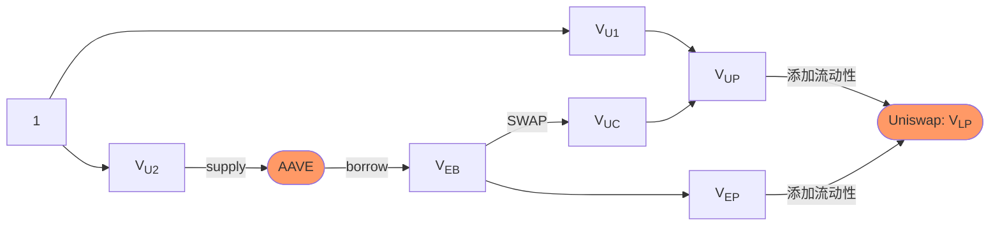
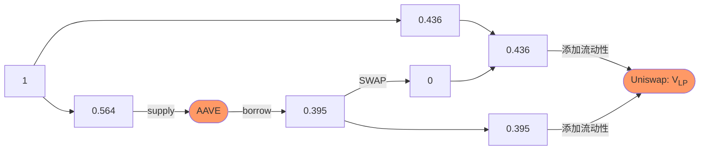
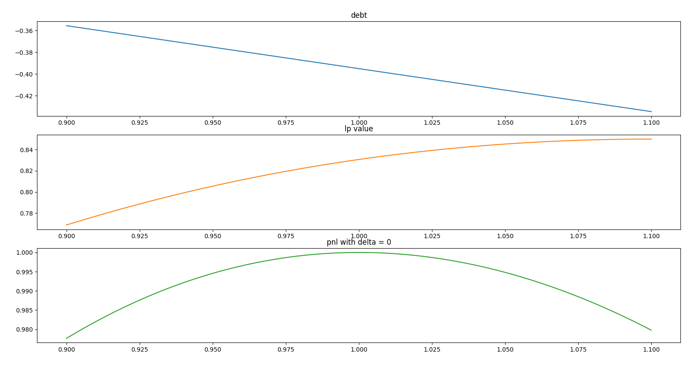
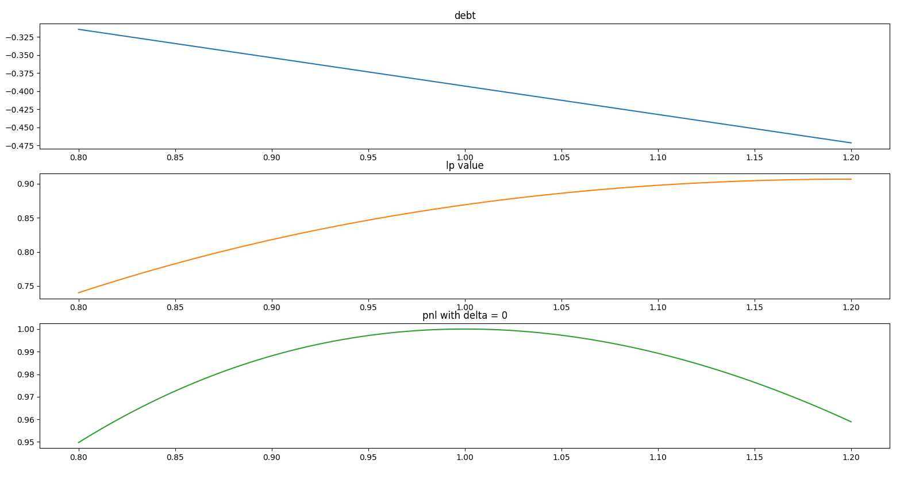
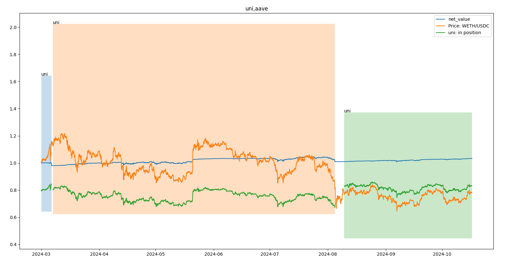
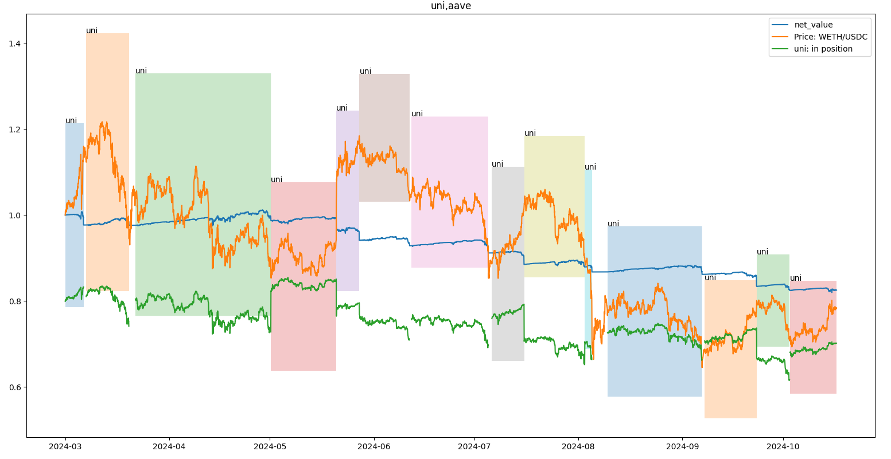

# Uniswap V3的Delta中性策略以及优化

## 引言

在 DEFI世界中，为Uniswap交易池供流动性是一种极具吸引力的投资策略。对于每个交易池，流动性提供者只需存入两种不同的代币，即可开始赚取该池的交易手续费。这种机制不仅为流动性提供者带来了收益，也促进了整个生态系统的流动性。然而，随着代币价格的波动，流动性的净值也会随之变化，这对流动性提供者的收益产生重要影响。

下图展示了在价格变动过程中，流动性净值的变化。其中横轴为价格，纵轴为净值。彩色线则显示了在不同的 tick 范围下，流动性的净值如何随着价格的变化，而虚线则代表单纯持有某个代币的净值变化。以ETH-USDT的池为例，当价格上升的时候，LP的净值会远远落后于单纯持有ETH，仅比单纯持有USDT好一些; 而在价格下降时，损失远远大于单纯持有USDT，仅比单纯持有ETH损失少一些。



看起来，这实际上相当于为自己添加了0.9倍的杠杆。然而，对于风险厌恶者来说，这种波动显然是不可接受的。特别是对于市值稍小的热门代币，价格的剧烈波动可能导致净值的显著变化; 但与此同时，热门的交易又会带来丰厚的手续费收入。那么，有没有办法既能避免净值的波动，又能稳定地赚取手续费呢？

## Delta中性策略

Delta中性策略可以解决这个问题。Delta是量化金融中常用的一个希腊值，含义是每当标的价格变化1个单位，衍生品的价格变化多少，用公式表示：
$$
Delta = \frac {衍生品的价格变化}{标的价格变化}
$$
比如，当我们说ETH-USDT池中，一个LP的Delta为0.5，那说明当ETH价格变化为1的时候，每单位流动性变化为0.5。如下表所示，如果我们投入了相当于5 ETH的流动性。当Delta=0.5时，如果ETH上涨1u，那么每单位流动性对应增加0.5u，因此，流动性对应的净值为10002.5u。

| 时间     | ETH价格 | 流动性对应净值       |
| -------- | ------- | -------------------- |
| 开始     | 2000    | 5 * 2000=10000       |
| 价格上涨 | 2001    | 5 * 2000.5 = 10002.5 |

引申一下，如果单纯持有ETH，那么无论ETH价格变化多少，投资组合的单位净值就对应变化多少，因此单纯持有ETH的Delta是1。对应的，如果单纯持有USDT，则无论价格怎么变化，单位净值都不会发生改变。此时投资组合的Delta是0.

而借出ETH可以提供负的Delta，比如，当前ETH价格为2000u，我们借入了1 ETH，并兑换成2000u。此时我们的净值为-2000 + 2000 = 0.那么当ETH价格减少100，变为1900，我们投资组合的净值变为-1900 + 2000 = 100.所以此时的Delta是100/-100 = -1。

Delta中性就是指让投资组合的Delta等于0.此时不管标的价格怎么变化，投资组合的净值都不会变。在Uniswap中，添加流动性会带来正Delta，通过借出特定量的ETH，得到负Delta，就能实现Delta中性。如果能在Uniswap中实现Delta中性，那么不仅LP的净值不会受到代币价格变化的影响，还能稳定的赚取手续费收益。即便手续费的年化收益只有8%也是很可观的，毕竟这是无风险收益。

## Uniswap V3流动性的Delta

实现Delta中性的关键，在于计算出投入流动性和借出ETH的比例。要达到这一点，首先要计算每单位流动性的Delta。在Uniswap V3中，每单位的净值可以用下面的公式计算。
$$
V=
\begin{cases}
liq \times P(\frac{1}{\sqrt{L}}-\frac{1}{\sqrt{H}}), P<L \\
liq \times (2\sqrt{P}-\sqrt{L}-\frac{P}{\sqrt{H}}), L<P<H \\
liq \times (\sqrt{H}-\sqrt{L}), H<P
\end{cases}
$$

$$
Liq=\frac{1}{2-\frac{1}{\sqrt{H}}-\sqrt{L}}
$$

其中: 

* P是当前价格
* L是添加流动性的价格下限
* H是价格的上限
* Liq是每单位的流动性。可以认为是1u的资金，在对应的做市范围下，相当于多少资金。

另外这里的价格是除以初始价格后的归一化价格，比如当前价格P0=2000，PH=2500，PL=1500，那么H=2500/2000=1。25，L=1500/2000=0.75，如果一段时间后当前价格PT=2100，那么P=2100/2000=1.05。

Delta是衍生品价格变化的指标，相当于对价格求导。因此，通过对上式求导可以得到Uniswap V3的Delta
$$
\frac{ \partial V}{\partial P} = 
\begin{cases}
liq \times (\frac{1}{\sqrt{L}}-\frac{1}{\sqrt{H}}), P<L \\
liq \times (\frac{1}{\sqrt{P}}-\frac{1}{\sqrt{H}}), L<P<H \\
0, H<P
\end{cases}
$$
当P在价格范围内，且假定P=1(初始价格为1)的情况下，可以化简为:
$$
\frac{1}{2-\frac{1}{\sqrt{H}}-\sqrt{L}} \times (\frac{1}{\sqrt{1}}-\frac{1}{\sqrt{H}})
$$
但是要注意，Uniswap V3的Delta是一个随价格变化的复杂函数。如下图所示。因此单纯的Delta对冲无法做到净值完全不波动，只能做到在一定的价格范围内，净值波动远小于直接投资，这一点在后面的例子会有体现。



## 在Uniswap V3中实现Delta中性

有了公式，我们可以设计资金流向了。为了方便计算，我们假定初始资金为1。另外假定交易池是USDC-ETH。



图中的V表示每部分资金的价值。

1. 将初始资金按价值分为两份U1和U2。
2. 将U2抵押到AAVE。
3. 从AAVE借出ETH，价值为$ V_{EB} $
4. 将$ V_{EB} $ 在分为两份，其中一份准备添加流动性，
5. 另一部分兑换成USDC(UC)，和U1一起，组成UP，添加流动性，设置UC的目的是添加一个控制量，确保整个流程有解。
6.  使用UP和EP两部分资金添加流动性。

上面的流程必须满足一些资金关系，最显而易见的初始资金的划分关系
$$
V_{U1} + V_{U2} = 1
$$
然后是借款关系，在这里，我们假定AAVE的借款系数是α，这个系数可以看作一个常数。应该小于AAVE的最大可借系数(LTV)，避免因为价格波动导致清算。这里的资金价值关系应满足: 
$$
α \times V_{U2} = V_{EB} \\
V_{EB} = V_{UC} + V_{EP}
$$
还有一个重要的关系是流动性的关系。经过推算，在限定了做市上下界的情况下，两种代币的价值比例必须满足下面的关系: 
$$
\frac{V_{EP}}{V_{UP}} = \frac {1-\frac{1}{\sqrt{H}}} {1-\sqrt{L}}
$$
最后，最重要的是Delta的关系，我们在上面求出了流动性的Delta，并且知道借贷的Delta是-1，那么考虑资金的价值，可以得到下面的公式: 
$$
V_{LP} \times \frac{\partial V}{\partial P} - V_{EB} = 0 \\
(V_{UP} + V_{EP}) \times \frac{\partial V}{\partial P} - V_{EB} = 0 \\
$$
将流动性的Delta展开，可以得到
$$
(V_{UP} + V_{EP}) \times\frac{1}{2-\frac{1}{\sqrt{H}}-\sqrt{L}} \times (1-\frac{1}{\sqrt{H}}) - V_{EB} =0
$$
由此，将上面的公式整理一下，我们可以得到
$$
V_{U1} + V_{U2} = 1 \\
\frac{V_{EP}}{V_{UP}} = \frac {1-\frac{1}{\sqrt{H}}} {1-\sqrt{L}} \\
(V_{UP} + V_{EP}) \times\frac{1}{2-\frac{1}{\sqrt{H}}-\sqrt{L}} \times (1-\frac{1}{\sqrt{H}}) - V_{EB} =0 \\
V_{U1} + V_{UC} = V_{UP} \\
 V_{EB} = V_{UC} + V_{EP} \\
α \times V_{U2} = V_{EB} \\
0 < V_{U1},V_{U2},V_{EB}, V_{UC}, V_{EP},V_{UP} < 1
$$
在已知H和L的情况下，我们可以求出每部分的资金分配。例如，在H=1.1，L=0.9，借款系数为0.7的时候，资金分配如下: 



随着价格变化，净值变化如下



在H=1.2，L=0.8，借款系数为0.75的时候，资金分配如下: 


随着价格变化，净值变化如下



可见随着价格变化，净值的波动被有效的控制住了，在H=1.1，L=0.9的做市区间内，当价格超出做市区间时(此时价格波动为10%)，总体净值的变化仅为2%。而当H=1.2，L=0.8的做市区间内，当价格超出(波动20%)，净值变化仅为5%。

这部分的代码实现，参见我们的[Github](https://github.com/zelos-alpha/delta-hedging/blob/master/math_lib_v1.py)

## 优化做市范围

现在我们已经解决了资金比例的问题。但是在我们的计算中，一直是将做市范围和借款系数作为常数。这两个参数对收益也有很大的影响。

其中借款系数并没有优化空间，只能在权衡风险后，取一个既贴近AAVE最大允许量，又不容易被清算的值。

做市范围(H和L)则不同，在Uniswap V3的世界中，如何选取做市范围一直都是困扰LP的难题，选取的过大，手续费的收益会变少。如果选取的过小，又很容易超出做市范围。

为了尽量提高手续费收益，并减少价格波动的影响，我们采取一种简单的策略，就是将做市范围和波动率挂钩。当波动率变大，使用较大的做市范围，避免频繁的超出做市范围。当波动率变小，使用较小的做市范围，获取更大的收益。用代码表示: 

```python
H = 1 + sigma * 上限系数
L = 1 - sigma * 下限系数
```

比如，当波动率为0.5时，如果我们采用(0.6,0.5)的参数，做市范围H=1.3,L=0.75

所以问题就转换成，如何选取合适的上限/下限系数。对于这个问题的建模，我们还在研究。这里我们采用统计的方式，看一下哪个参数组合能够获取最大的收益。具体来说，就是在一定时期内，使用Demeter对不同参数进行回测。测试哪组参数盈利最高。

Demeter([https://github.com/zelos-alpha/demeter](https://github.com/zelos-alpha/demeter))是专注于DeFi以及衍生品的回测框架，支持Uniswap V3，AAVE，squeeth以及Deribit期权，通过编写回测代码，可以评估策略的表现。

利用Demeter，我们编写了一个策略([https://github.com/zelos-alpha/delta-hedging/blob/master/strategy.py](https://github.com/zelos-alpha/delta-hedging/blob/master/strategy.py))，主要思路为: 

1. 根据波动率确定做市范围，然后按照上述的方式计算资金比例。(当波动率过大时，避免做市。)
2. 将一部分资金存入AAVE，然后借出ETH，最后按比例投入流动性。
3. 当价格超出做市范围或者净值(扣除手续费收益)变化达到2%时，退出当前仓位并重新做市。这样做的目的是避免价格变化过大导致投资组合的Delta与0的偏差过大。

我们在Ethereum上的usdc-eth(手续费0.05%)池进行了回测。时间范围是2024年3月1日~2024年10月16日，并测试不同参数下收益率的影响。其中行是上限参数，列是下限参数。


|     | 0.1       | 0.3       | 0.5       | 0.7       | 0.9       |
| --- | --------- | --------- | --------- | --------- | --------- |
| 0.1 | 0.007605  | -0.079808 | -0.065426 | -0.007842 | -0.024968 |
| 0.3 | 0.014828  | -0.262482 | -0.076196 | 0.031028  | 0.012538  |
| 0.5 | -0.165599 | -0.107021 | -0.103836 | 0.001964  | 0.045359  |
| 0.7 | -0.164113 | -0.124262 | -0.087535 | 0.046455  | 0.023214  |
| 0.9 | -0.163186 | -0.118111 | 0.053217  | 0.024454  | 0.016023  |

从图中可以看出，当上限为0.9，下限为0.5时，收益率最高。在这个参数下，策略的指标为: 

| name       | value   |
| ---------- | ------- |
| 收益       | 332.105 |
| 收益率     | 0.033   |
| 年化收益率 | 0.053   |
| 最大回撤   | 0.037   |
| 夏普比率   | 0.352   |
| 波动率     | 0.066   |
| Alpha      | 0.074   |
| Beta       | 0.064   |
| ETH收益    | -0.216  |
| ETH收益率  | -0.321  |

收益曲线为



图中色块表示做市范围以及做市时间，曲线代表不同的净值。从图中可见，虽然所选的做市范围较宽，导致手续费收益不高。但是无论价格向上还是向下波动，总净值非常稳定。最终，凭借持续的手续费收益，获得了最佳的盈利。

作为对比，我们看一下最差参数(0.3,0.3)的净值曲线



可见，这次的调仓频率远远高于上次，由于每次调仓相当于承受2%的损失(我们的退出条件之一时净值变化超过2%)，因此随着每次调仓，净值一直减少。最终造成了较大的损失。

为了求得更优化的参数，我们又在最佳参数附近，选取了精度更高的参数进行回测。最终得到如图所示:

|      | 0.3       | 0.4       | 0.5       | 0.6      | 0.7      |
| ---- | --------- | --------- | --------- | -------- | -------- |
| 0.80 | -0.119078 | -0.109294 | -0.062631 | 0.049845 | 0.044852 |
| 0.85 | -0.11856  | -0.069104 | -0.062596 | 0.048965 | 0.044573 |
| 0.90 | -0.118111 | -0.0696   | 0.053217  | 0.048124 | 0.024454 |
| 0.95 | -0.1177   | -0.070049 | 0.052284  | 0.047364 | 0.024177 |
| 1.00 | -0.076439 | -0.06983  | 0.051439  | 0.026534 | 0.023935 |

最终仍然是(0.9,0.5)胜出。从表中也可以看出，收益的变化符合一个大概的趋势。

## 总结

本文讨论了Delta中性的概念，以及如何借助AAVE借贷在Uniswap V3中实现Delta中性。然后讨论了优化做市上下界的方法。最终，通过Demeter回测，尝试出最优做市范围的参数组合。 
