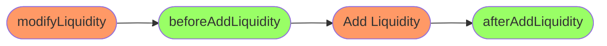
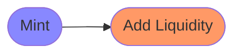
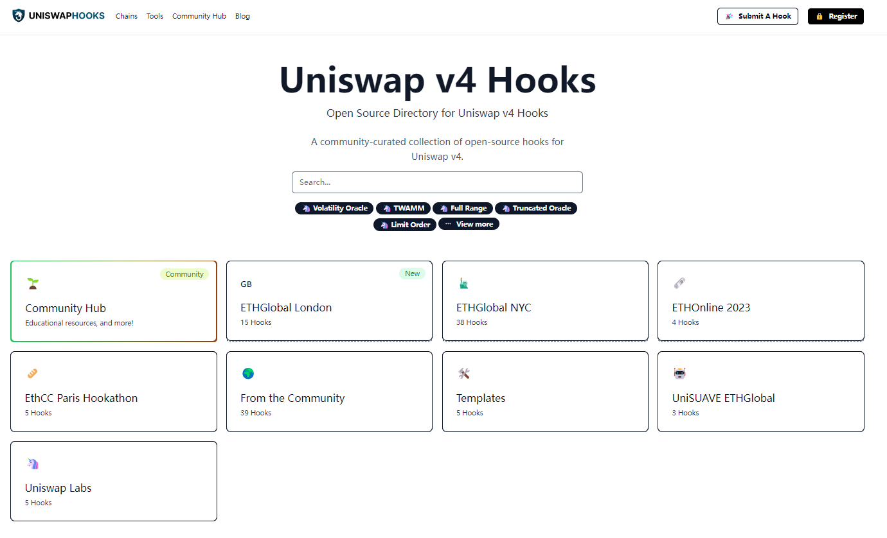

# Uniswap V4 Hook介绍

时隔三年, Uniswap终于发展到v4版本. Uniswap是一个非常有上进心的项目, 每次升级都会带来很大的变化, 比如从V2升级到V3实现了集中流动性, 从而提高了资金的利用率, 这使得Uniswap在AMM赛道中再次领先.

在V4中, 这种野心也表现的淋漓尽致. V4提供了很多新的功能, 如Hook机制, 单例合约, 闪电记账等. 其中最重要的是Hook机制. 它允许项目方在创建交易池时, 声明一个Hook合约, 用户在这个池进行流动性操作和swap操作时, 会触发对应的逻辑. 这个改变并不大, 从程序开发的角度来说, 不过是回调的应用罢了. 但从业务的角度来说, 带来的变化是翻天覆地的. 我们可以用BTC和ETH的关系作为类比, Bitcoin实现了代币的持有和交换, 而Ethereum在这个基础上附加了智能合约, 最终衍生出DeFi这个庞大市场. 在Ethereum之前, 很难想象这些语法简单的solidity代码能够衍生出近千亿美元的产业. 而Uniswap V4也是类似, 在V3完善的交易机制上, 允许项目方实现自己的逻辑, 从而衍生出各局想象力的项目. 

要认识Hook, 首先要看看V4中的流动性池是什么样子. Uniswap V4中, 每个流动性池不再对应一个合约, 而是所有池统一在一个合约下.因此创建池的过程, 也从部署合约, 变成调用合约. 这是官方创建池的例子. 

```solidity
// SPDX-License-Identifier: MIT
pragma solidity ^0.8.20;

import {IPoolManager} from "v4-core/src/interfaces/IPoolManager.sol";
import {IHooks} from "v4-core/src/interfaces/IHooks.sol";
import {PoolKey} from "v4-core/src/types/PoolKey.sol";
import {CurrencyLibrary, Currency} from "v4-core/src/types/Currency.sol";

contract PoolInitialize {
    using CurrencyLibrary for Currency;

    // set the initialize router
    IPoolManager manager = IPoolManager(address(0x01));

    function init(
        address token0,
        address token1,
        uint24 swapFee,
        int24 tickSpacing,
        address hook,
        uint160 sqrtPriceX96,
        bytes calldata hookData
    ) external {
        // sort your tokens! v4 requires token0 < token1
        if (token0 > token1) {
            (token0, token1) = (token1, token0);
        }

        PoolKey memory pool = PoolKey({
            currency0: Currency.wrap(token0),
            currency1: Currency.wrap(token1),
            fee: swapFee,
            tickSpacing: tickSpacing,
            hooks: IHooks(hook)
        });
        manager.initialize(pool, sqrtPriceX96, hookData);
    }
}
```

在创建流动性池的过程中, 先声明了一个PoolKey, 在V4中, PoolKey是Pool的唯一ID, 也就是流动性池的身份证, 在这个ID中, 除了传入Token和手续费外, 还传入了Hook合约地址. 可见, 对于同样的币对和手续费, 如果Hook不同, 会被看作不同的流动性池. 这是和V3一个很大的区别. 

而在真正创建池的时候(```manager.initialize(pool, sqrtPriceX96, hookData);```), 又传入了初始价格, 以及hookData. hookData可以将一些初始化的参数传递给Hook. 

一个简单的Hook合约的例子如下: 

```solidity
// SPDX-License-Identifier: MIT
pragma solidity ^0.8.20;

import {BaseHook} from "v4-periphery/src/base/hooks/BaseHook.sol";
import {PoolKey} from "v4-core/types/PoolKey.sol";
import {IPoolManager} from "v4-core/interfaces/IPoolManager.sol";
import {Hooks} from "v4-core/libraries/Hooks.sol";

contract SampleHook is BaseHook  {
    constructor(IPoolManager _manager, string memory _name, string memory _symbol) BaseHook(_manager){
		// do something
    }

    function getHookPermissions() public pure override returns (Hooks.Permissions memory) {
        return Hooks.Permissions({
            beforeInitialize: false,
            afterInitialize: false,
            beforeAddLiquidity: true,
            beforeRemoveLiquidity: false,
            afterAddLiquidity: true,
            afterRemoveLiquidity: false,
            beforeSwap: false,
            afterSwap: false,
            beforeDonate: false,
            afterDonate: false,
            beforeSwapReturnDelta: false,
            afterSwapReturnDelta: false,
            afterAddLiquidityReturnDelta: false,
            afterRemoveLiquidityReturnDelta: false
        });
    }
    function beforeAddLiquidity(
        address sender,
        PoolKey calldata key,
        IPoolManager.ModifyLiquidityParams calldata params,
        bytes override calldata hookData
    ) external returns (bytes4){
    	// do something
    }
    function afterAddLiquidity(
        address sender,
        PoolKey calldata key,
        IPoolManager.ModifyLiquidityParams calldata params,
        BalanceDelta delta,
        bytes calldata hookData
    ) external override returns (bytes4, BalanceDelta); {
		// do something
    }
}
```

从例子中我们可以看到，Hook是一个合约，而且继承于BaseHook。其中，BaseHook的getHookPermissions函数是必须重载的。通过这个函数，可以设置在哪些流程中添加逻辑：

* 初始化前后
* 添加流动性前后
* 移除流动性前后
* Swap前后
* 捐赠(一个V4的新概念)前后
* 在Swap返回金额变动之前
* 在Swap, 添加流动性, 移除流动性的金额改变之后

比如我们想添加流动性之前和之后进行一些操作, 因此将beforeAddLiquidity, afterAddLiquidity设置为True.

最后, 重载beforeAddLiquidity和afterAddLiquidity函数, 每次这个池发生添加流动性交易之后, 就会执行这个函数中的逻辑. 

整体流程如下图, 其中橙色代表PoolManager合约, 绿色代表Hook合约


作为对比, V3中, 添加流动性的过程是这样的, 其中蓝色代表proxy合约, 橙色代表pool合约.


Hook极大的扩展了流动性池的业务范围, 可以实现很多具备想象力的业务. 比如

* 基于波动率或者时间的动态手续费

* 将借贷平台整合进来, 把限制的流动性放入借贷平台做抵押, 防止资金空置.

* 添加流动性的手续费享受复利. 

* 收取一部分手续费用于社区治理

* Swap交易使用限价单机制.

* 多签

* KYC

  

因此, 只要想象力足够, 完全可以依托V4平台, 打造出自己的交易所, 甚至发明新的衍生品类型. 而V4可以提供流动性管理和交易的支持, 减少构建新项目的成本. 现在已经有很多团队开发了自己的Hook.  



但由于V4还没有发布, 线上的资源还很少, 连API文档都没发布. 如果想要进一步了解, 可以关注一下[官方的介绍](https://docs.uniswap.org/contracts/v4/overview), 以及[官方的例子](https://www.v4-by-example.org/), 另外, 我们也翻译了[正式版白皮书](https://mp.weixin.qq.com/s/YbEgKI0z12JLLP1EdXxCEA).

在后面的文章中, 我会介绍如何编写Hook. 以及背后的机理.

